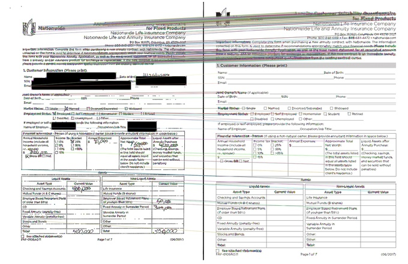

# Image registration: automatically aligning documents to a common template
This repo contains code for image registration based on classical computer vision techniques, namely keypoint detection, RANSAC estimation, and homographies.

The algorithm aligns (registers) an image to a template. Here we show the original, warped, image before and after applying our image registration algorithm. The data comes from a set of scanned documents from Nationwide bank all with the same template. Each document is a scanned and filled-out version of a blank form (not shown) which we use as our template.

## Installation and usage
1. Copy `register_image.py` into your path
2. Make sure hyperparameters within the top few lines of `register_image.py` are set the way you like them.
3. In your code, make sure you have the `candidate` and `template` images in numpy array format where the shape is `width, height, 3`. Shapes need not be the same between candidate and template, but the final aligned image will have the same shape as the template
4. Insert into beginning of your code `from register_image import register_image`
5. To align the image: `aligned = register_image(candidate, template)`

See `main.py` for a demo on aligning the first page of all the nationwide documents

## Method
Suppose you have an scanned, hand-marked *candidate* document (left in picture below) that you wish you wish to align to a *template* document (right). One way to do it would be to first identify common *keypoints* that occur in both documents, such as the corner of the Nationwide logo, or the bottom tip of the "P" in "Products". Then stretch the candidate document such that all its keypoints overlap with the corresponding keypoints in the template document. The following image illustrates the idea of keypoint matching. That is the gist of how feature-based image registration works. 

In image registration, we have use the following algorithms:
1. Identify keypoints using a feature detector. We use [ORB](https://docs.opencv.org/3.0-beta/doc/py_tutorials/py_feature2d/py_orb/py_orb.html)
2. Match those keypoints according to Hamming distance (number of non-matching symbols in the feature vector)
3. Remove bad matches using thresholds (of match score and Euclidean distance in pixel space) and [RANSAC](https://en.wikipedia.org/wiki/Random_sample_consensus)
4. Compute [homography](https://en.wikipedia.org/wiki/Homography_(computer_vision)) using remaining keypoint pairs
5. Warp the candidate image via multiplication of all its pixel positions with the homography matrix

## Questions
W. Ronny Huang \
wronnyhuang@gmail.com
